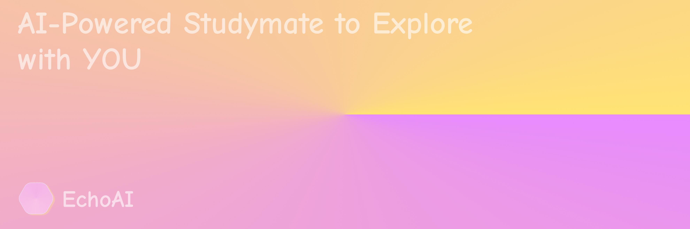

  <h1>EchoAI</h1>
  
Visual and Interactive Companion AI Learning Partner

  <a href="https://echo.bingo">[🔗 App]</a> 
  <a href="https://echo.bijon.ai/blog">[📄 Blog]</a> 
  <a href="mailto:info@bijon.ai">[📮 Contact]</a> 
  <a href="https://github.com/bijonai/EchoAI">[GitHub]</a> 
  <a href="https://github.com/sciux-kit">[Sciux Community]</a> 
  <a href="https://bijon.ai">[🔗 BijonAI]</a> 
  <a href="./README.zh.md">[中文]</a>

 

> [!NOTE]
>
> We plan to conduct a small-scale beta test from October to December 2025. If you're interested, please contact us at [info@bijon.ai](mailto:info@bijon.ai)!
>
> The Sciux component library and knowledge base are still under development, and you can find them at https://github.com/sciux-kit.

Have you ever watched the math videos by the famous YouTube creator [3Blue1Brown](https://www.youtube.com/@3blue1brown)?
His stunning math videos and animations have sparked interest in mathematics for many students, and all his videos are created using his self-developed animation engine [Manim](https://www.manim.com/).
> Our Sciux component library draws heavily on the style of Manim, so we are grateful to 3Blue1Brown and Manim for the inspiration!

Later, several teams used LLMs to generate Python code for rendering Manim videos. Some were open-source projects, while others were auxiliary modules for educational AI products. However, they all faced significant issues:

1. Python code has low fault tolerance, and combined with issues like LLM output accuracy and hallucinations, the generated Python code often contains errors.
2. Rendering a Manim video takes a long time, making it inefficient for real-time educational AI products, and video rendering places a heavy burden on servers.
3. The generated videos lack precision and are limited in length, failing to meet the needs of educational AI products.

To address these issues, we developed Sciux – defined as an “AI-native interactive DSL language” designed specifically to adapt to LLM generation:
- We drew heavily from Vue’s syntax and used [@vue/reactivity](https://github.com/vuejs/core) in our renderer Laplace (https://github.com/sciux-kit/laplace) as the foundation for reactivity.
- Sciux syntax supports embedding JavaScript expressions but is fully structured, eliminating the need to write JavaScript statements to control interaction logic.
- The syntax also allows defining animations, loops, conditions, and other control flows for each component.
- [Sciux Library](https://github.com/sciux-kit/lib) supports a wide range of layouts, interactions, and components for mathematics, physics, statistics, and various disciplines, along with animations and utility functions.
- [Sciux Knowledge](https://github.com/sciux-kit/knowledge) includes sample code for various disciplinary units, used for RAG retrieval and planned fine-tuning of smaller models in the future.

To meet the actual learning needs of students, we designed additional UX features beyond the canvas:

1. **Pre-designed Teaching Plans and Timeline Generation**

Using the model, we pre-design teaching steps based on user needs and course content, generating a subway-style timeline below to significantly improve user focus. This transforms the traditional chatbot’s one-time knowledge delivery into AI-guided companion learning.

When you encounter a question you don’t understand, you can pause at any point, and EchoAI will generate a side branch to explain while creating diagrams.

2. **Multi-Model Design**

Our functionality consists of four LLM contexts:

- 📄 **Designer**: The course designer, triggered by each user query, designs a timeline and provides corresponding teaching steps based on the query.
- 🧑‍🏫 **Speaker**: Delivers explanations for each timeline node based on the Designer’s plan.
- 🎨 **Layout**: The layout designer creates corresponding layouts, components, and games based on the Designer’s plan.
- 🖌️ **Chalk**: The artist writes Sciux code or modifies existing documents based on the Layout’s design.

3. **Course Community**

We plan to introduce a course community in EchoAI, where users can upload their own courses, with future plans to open revenue opportunities for content creators.

Additionally, we plan to include courses, practice questions, and real exam questions for A-level, AP, SAT, and other exam systems as official community content.

## 📚 Our Published Content
- [2025-06-04@About EchoAI’s Generation and Modification of Structured Data](https://echo.bijon.ai/blog/2025-06-04.html)
- [2025-06-03@About EchoAI](https://echo.bijon.ai/documentation/guides/about-echoai.html)

## 🗺️ Get Started

For those who want to deploy the project locally, please refer to [docs/RUN.md](./docs/RUN.md).

## 🤝 Contributors

## 🌟 Star History

***Copyright (c) 2025 BijonAI Team***