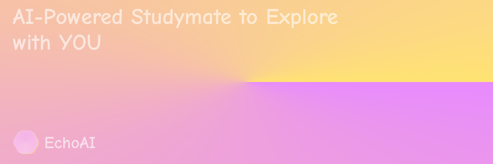

  <h1>EchoAI</h1>
  
可视化可交互的陪伴式AI学习搭子

  <a href="https://echo.bingo">[🔗 App]</a> 
  <a href=https://echo.bijon.ai/blog">[📄 博客]</a> 
  <a href="mailto:info@bijon.ai">[📮 联系]</a> 
  <a href="https://github.com/bijonai/EchoAI">[GitHub]</a> 
  <a href="https://github.com/sciux-kit">[Sciux社区]</a> 
  <a href="https://bijon.ai">[🔗 BijonAI]</a> 
  <a href="./README.md">[English]</a>

 

> [!NOTE]
>
> 我们准备在2025年10月～12月期间进行小范围的内测，如果感兴趣，请使用[info@bijon.ai](mailto:info@bijon.ai)联系我们!
>
> 目前的Sciux组件库和知识库仍在完善，你可以在 https://github.com/sciux-kit 中找到他们。

你曾经看过一个著名的Youtube博主[3Blue1Brown](https://www.youtube.com/@3blue1brown)的数学视频吗？
他精美的数学视频和动画，让很多学生对数学产生了兴趣，而他的所有视频都是由他自己开发的动画引擎[Manim](https://www.manim.com/)制作的。
> 我们的Sciux组件库也大量仿照了Manim的风格设计，所以感谢3Blue1Brown和Manim给我们的灵感！

后来，也有不少团队做了LLM生成Python代码来渲染Manim视频，他们有些作为一个开源项目，有些作为教育类AI产品的附属模块，但是无一例外都出现了很多的问题

1. Python代码的容错率低，再加上LLM的输出精度和幻觉等问题，生成的python代码经常出错
2. Manim编译一个视频需要很长时间，如果真正落地到即时的教育AI产品中，用户使用效率极低，而且渲染视频对服务器压力极大
3. 生成的视频精度不高，而且生成的视频长度有限，无法满足教育类AI产品的需求

所以我们开发了Sciux - 我们给他的定义是“AI原生交互DSL语言”，他的所有特性都为了更好的适应LLM生成
- 我们在语法中大量借鉴了Vue, 并在渲染器Laplace(https://github.com/sciux-kit/laplace)中使用了[@vue/reactivity](https://github.com/vuejs/core)作为我们响应式的基础
- Sciux语法支持插入JavaScript表达式，但是他是全部结构化的，不需要写JavaScript语句来操控交互逻辑
- 同时，语法中还允许给每个组件定义动画和遍历，条件等控制流
- [Sciux Library](https://github.com/sciux-kit/lib)支持了很多布局，交互，数学，物理，统计学以及各种学科的相关组件，动画和工具函数
- [Sciux Knowledge](https://github.com/sciux-kit/knowledge)包含了很多学科领域单元的示例代码，用于RAG检索和后面计划中的小模型微调

针对实际学习者的学习需求，我们做了除了画板更多的UX设计

1. 教学方案预设计和时间线生成

通过模型根据用户需求和课程内容进行教学步骤预设计，并在下方生成一个地铁线路风格的时间线，可以很大程度的提高用户的专注度，并真正将传统的Chatbot一次性灌输所有知识转变为AI陪伴式学习

当你有不懂的问题，你可以在某一处打断，EchoAI会生成一个支线来一边解答一边画图

2. 多模型设计

我们的功能由四个LLM上下文组成:

- 📄 Designer: 课程设计师，你的每一次提问都会触发Designer的思考，它将根据你的提问来设计出一条时间线，并给出对应的教学步骤
- 🧑‍🏫 Speaker: 根据每一个时间节点，Speaker会给出对应的讲解，它将根据Designer的设计来给出对应的讲解
- 🎨 Layout: 布局设计师，它将根据Designer的设计来给出对应的布局，组件与游戏
- 🖌️ Chalk: 画师，它将根据Layout的设计来写出Sciux代码或对现有文档进行操作和修改

3. 课程社区

我们计划在EchoAI中引入课程社区，用户可以上传自己的课程，并在后续开放内容创作者收益。

同时，我们计划引入A-level,AP,SAT等考试体系的课程，习题，以及考试真题作为社区官方内容的补足

## 📚 我们发布的内容
- [2025-06-04@关于EchoAI对于结构化数据的生成与更改](https://echo.bijon.ai/blog/2025-06-04.html)
- [2025-06-03@About EchoAI](https://echo.bijon.ai/documentation/guides/about-echoai.html)

## 🗺️ Get Started

对于想要本地部署项目的同学，请参考[docs/RUN.zh.md](./docs/RUN.zh.md)

## 🤝 贡献者

## 🌟 Star历史

***Copyright (c) 2025 BijonAI Team***
